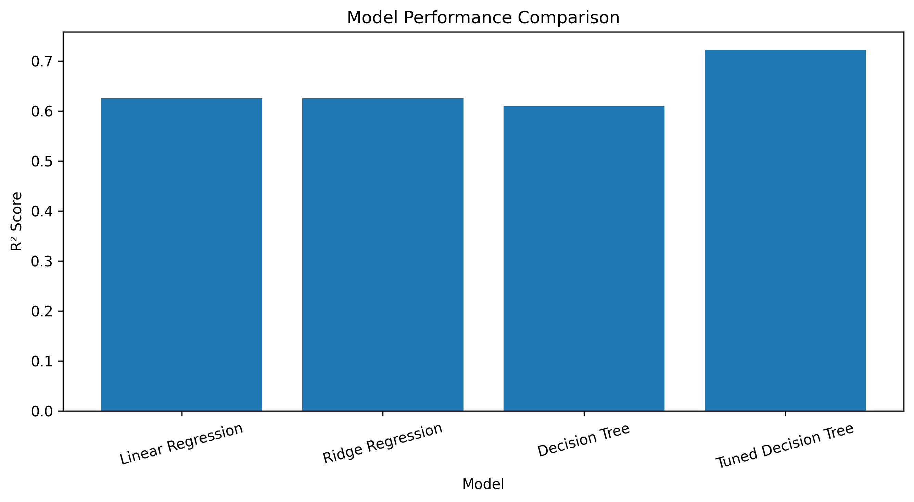
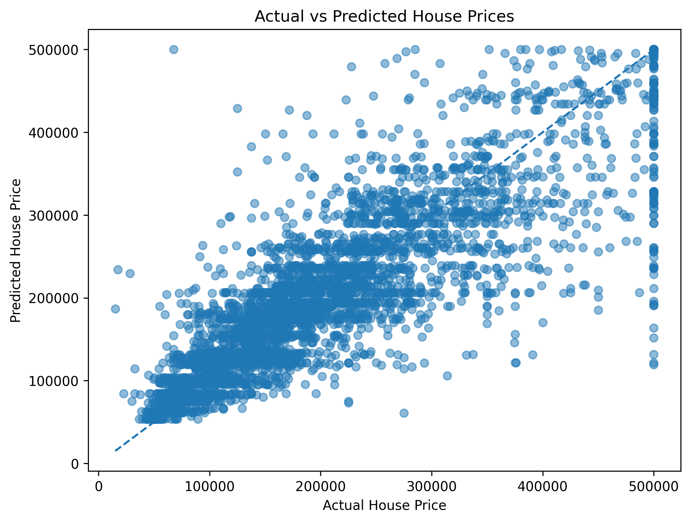

# 🏠 House Price Prediction - Model Evaluation & Tuning

A Machine Learning project focused on evaluating and improving house price prediction models using model comparison, cross-validation, and hyperparameter tuning.

This project extends the basic regression workflow by optimizing a Decision Tree Regressor and comparing its performance with baseline regression models.

---

# 🛠️ Technologies Used

<p align="center">


</p>

---

# 🚀 Features

- California house price prediction
- Data preprocessing
- Feature scaling
- Train-test splitting
- Multiple regression models
- Model performance evaluation
- RMSE and R² Score calculation
- 5-Fold Cross-Validation
- Hyperparameter tuning using GridSearchCV
- Decision Tree optimization
- Best parameter selection
- Baseline vs tuned model comparison
- Actual vs Predicted visualization
- Model comparison visualization
- Final tuned model selection
- Save optimized model using Joblib

---

# 🤖 Machine Learning Models

The following models were evaluated:

1. **Linear Regression**
2. **Ridge Regression**
3. **Decision Tree Regressor**
4. **Tuned Decision Tree Regressor**

The Decision Tree Regressor was optimized using hyperparameter tuning to improve its prediction performance.

---

# ⚙️ Project Workflow

1. Load the California Housing dataset.
2. Explore the dataset.
3. Perform data preprocessing.
4. Handle missing values.
5. Encode categorical features.
6. Separate features and target variable.
7. Apply feature scaling.
8. Split the dataset into training and testing sets.
9. Train baseline regression models.
10. Evaluate baseline models using RMSE and R² Score.
11. Perform 5-Fold Cross-Validation.
12. Apply hyperparameter tuning using GridSearchCV.
13. Identify the best Decision Tree parameters.
14. Train the optimized Decision Tree model.
15. Evaluate the tuned model.
16. Compare baseline and tuned model performance.
17. Select the final model.
18. Generate visualizations.
19. Save the final tuned model using Joblib.

---

# 📊 Dataset

The project uses the **California Housing Dataset**.

The dataset contains information about different housing characteristics such as:

- Longitude
- Latitude
- Housing Median Age
- Total Rooms
- Total Bedrooms
- Population
- Households
- Median Income
- Ocean Proximity
- Median House Value

The target variable is:

**`median_house_value`**

---

# 🔄 Cross-Validation

5-Fold Cross-Validation was used during hyperparameter tuning to evaluate different parameter combinations across multiple training and validation splits.

**GridSearchCV** was used with 5-fold cross-validation to identify the best hyperparameters for the Decision Tree Regressor.

---

# 🎯 Hyperparameter Tuning

The Decision Tree Regressor was optimized using GridSearchCV.

### Best Parameters

- **max_depth:** 10
- **min_samples_leaf:** 4
- **min_samples_split:** 10

The tuned model achieved significantly better performance compared with the original Decision Tree.

---

# 📈 Model Performance

| Model | RMSE | R² Score |
|-------|------:|---------:|
| Linear Regression | 70,060.52 | 0.6254 |
| Ridge Regression | 70,057.42 | 0.6255 |
| Decision Tree | 71,510.90 | 0.6098 |
| Tuned Decision Tree | 60,324.49 | 0.7223 |

---

# 🏆 Best Performing Model

**Tuned Decision Tree Regressor**

The tuned Decision Tree achieved:

- **RMSE:** 60,324.49
- **R² Score:** 0.7223

Compared with the baseline Decision Tree:

- Baseline R² Score: **0.6098**
- Tuned R² Score: **0.7223**

This demonstrates a significant improvement after hyperparameter tuning.

---

# 📊 Visualizations

## Model Comparison

The model comparison chart shows the R² Score achieved by the evaluated regression models.

<p align="center">

</p>

---

## Actual vs Predicted House Prices

This visualization compares the actual house prices with the prices predicted by the final tuned Decision Tree model.

<p align="center">

</p>

---

# 📂 Project Structure

```text
House_Price_Model_Optimization//
│
├── Model_Evaluation_Tuning.ipynb
├── housing.csv
├── tuned_decision_tree_model.pkl
├── requirements.txt
├── README.md
├── LICENSE
│
└── images/
    ├── model_comparison.png
    └── actual_vs_predicted.png
```

---

# ▶️ How To Run

## Clone Repository

    git clone https://github.com/TheAdityaGautam/House_Price_Model_Optimization.git

## Open Project

    cd House_Price_Model_Optimization

## Create Virtual Environment

    python -m venv venv

## Activate Virtual Environment

### Windows

    venv\Scripts\activate

### macOS/Linux

    source venv/bin/activate

## Install Required Libraries

    pip install -r requirements.txt

## Open Jupyter Notebook

    jupyter notebook

Open the following notebook:

**`Model_Evaluation_Tuning.ipynb`**

Run the notebook cells sequentially to reproduce the model evaluation, cross-validation, hyperparameter tuning, and final model results.

---

# 💾 Saved Model

The final optimized Decision Tree model is saved using Joblib:

**`tuned_decision_tree_model.pkl`**

This saved model can be loaded later without repeating the complete training and hyperparameter tuning process.

---

# 📊 Final Results

| Metric | Result |
|---|---:|
| RMSE | 60,324.49 |
| R² Score | 0.7223 |

The tuned Decision Tree Regressor achieved better performance than the baseline models.

---

# 🎯 Future Improvements

- Random Forest Regression
- XGBoost Regression
- Gradient Boosting
- Advanced Feature Engineering
- Randomized Search
- More extensive hyperparameter tuning
- Additional regression algorithms
- Model deployment

---

# 🌟 Conclusion

This project demonstrates the importance of model evaluation, cross-validation, and hyperparameter tuning in Machine Learning.

The baseline Decision Tree achieved an R² Score of **0.6098**, while the optimized Decision Tree achieved an R² Score of **0.7223**.

This improvement demonstrates that suitable hyperparameter selection can significantly improve model performance.

Therefore, the **Tuned Decision Tree Regressor** was selected as the final model.

---

# Developed By
Harpreet Singh
AI & ML Developer
